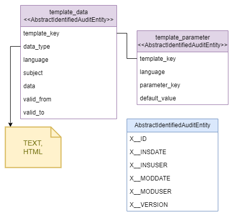

:toc: left
:toclevels: 4
:sectnums:
:sectnumlevels: 4
:source-highlighter: rouge
:rouge-style: thankful_eyes
:icons: font

= template-module-liquibase

A Liquibase-based project that contains the necessary scripts
for creating the database schema for the template-module project.

== Schema

The database schema is as follows:

== Prerequisites

* docker
* docker compose

== How to use

1 - Start Docker.

2 - Run the following command from the root directory of the project:

.start-local-mariadb
[source,bash]
----
docker compose -f docker/docker.compose.local.mariadb.yml up -d
----

This command will start the `evocelot-template-module-mariadb` container within the Docker instance,
which is the instance of the MariaDB database management system defined in the compose file.

3 - Execute the Liquibase changesets by running the following command:

.run-liquibase-changelog
[source,bash]
----
docker compose -f docker/docker.compose.local.template-module.liquibase.yml up -d
----

This command will execute the `/changelog/liquibase-template-service-changelog.xml` file,
which creates the necessary database elements for the file-service project.

== Building the Docker image

If you want to create the Docker image from the current state,
you need to run the following command from the root directory:

.build-docker-image
[source,bash]
----
docker build -t <image-name>:<tag-name> .
----

[NOTE]
The `<image-name>` and `<tag-name>` variables in the command can be set to anything.
For example, evocelot/template-module-liquibase:0.1.0
